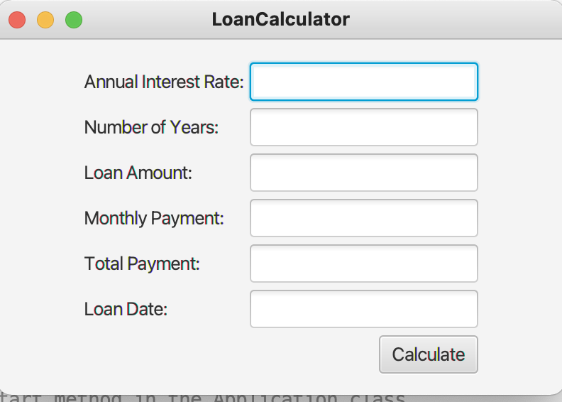
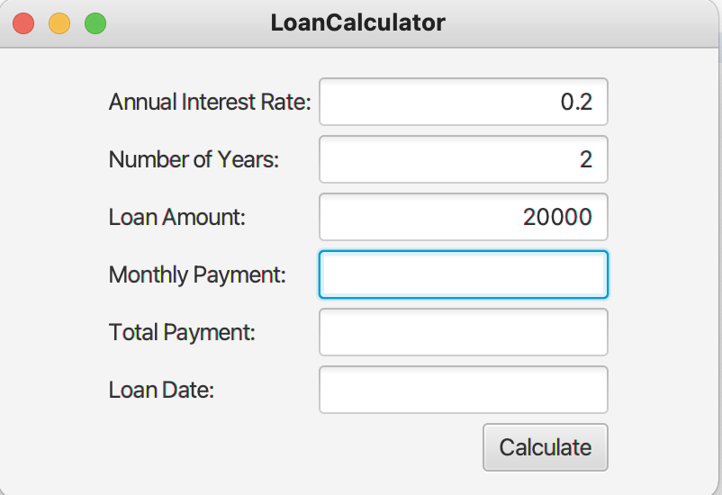
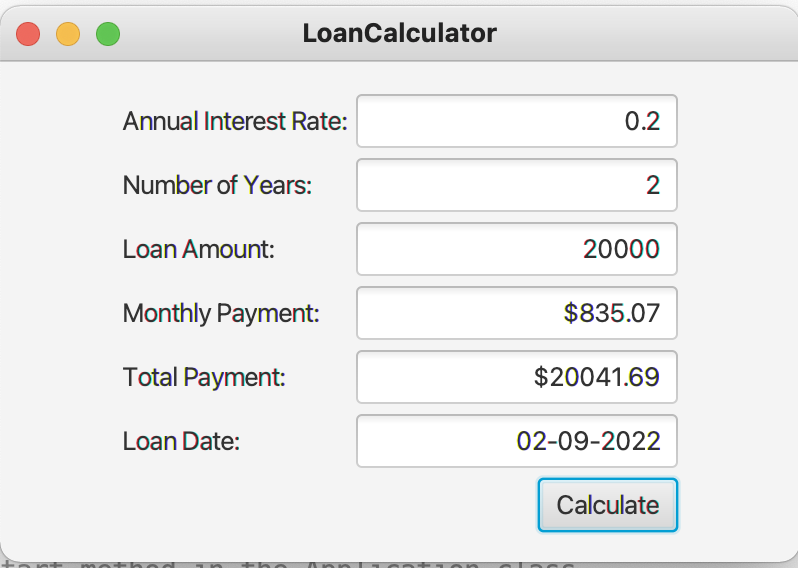

# Loan Calculator

## Introduction

Loan Calculator apps is a program used to calculate the monthly payment, total payment that student need to pay back after school

## Features

1. Using JavaFx to display friendly user interface
2. Let user enter amount of annual interest Rate
3. Let user enter Number of year to loan
4. Let user enter Loan Amount
5. calculate and display the total for monthly payment , total payment and Loan dates

## Getting Started

### Installation and setup

1. You need Netbeans IDE for Java to be able to run this program.
2. Clone this repository and import it into Netbeans

### Run

#### 1. Loan Calculator menu

Run LoanCalculator.java and Enter Annual Interest Rate, Number of Years, Loan Amount

#### 2. Click Calculate button

The amount of monthly payment, total payment and Loan Date will show up.

## Contributing

Pull requests are welcome. For major changes, please open an issue first to discuss what you would like to change.

Please make sure to update tests as appropriate.
